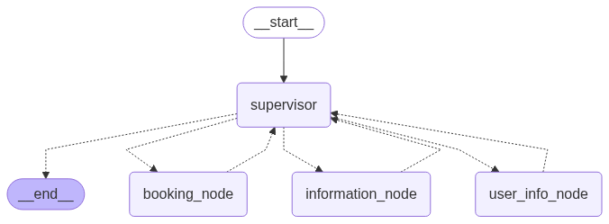

# Meeting Room Booking System

A multi-agent AI system for managing meeting room bookings, availability, and user information.

## System Overview

The Meeting Room Booking System is an intelligent conversational agent that helps users book, reschedule, and cancel meeting rooms. It provides information about room availability, features, and the user's booking history. The system uses a multi-agent architecture built with LangGraph to route user queries to specialized agents based on intent recognition.

## Architecture

The system is composed of four main components:
1. **Supervisor Agent** - Routes user queries to specialized agents based on intent analysis
2. **Room Information Agent** - Provides information about room availability and features
3. **Booking Agent** - Handles room booking, cancellation, and rescheduling 
4. **User Info Agent** - Retrieves user booking information

### Workflow Diagram



## Components

### 1. Supervisor Node (`supervisor_node`)
- Acts as the central router for all incoming user queries
- Analyzes intent and extracts key parameters (dates, times, room IDs, booking IDs)  
- Routes requests to specialized agents
- Maintains user identity information across conversations
- Determines when a conversation is complete

### 2. Room Information Agent (`room_information_agent`) 
- Provides information about meeting room availability
- Checks availability based on room features or specific room ID
- Has access to room features (capacity, projector, whiteboard, internet)
- Returns available time slots for rooms matching criteria

### 3. Booking Agent (`booking_agent`)
- Handles booking, cancellation, and rescheduling requests
- Books rooms based on room ID, date/time, and duration
- Cancels bookings using booking ID
- Reschedules bookings to new time slots

### 4. User Info Agent (`user_info_agent`)
- Retrieves and provides booking information for a specific user
- Returns booking details including booking IDs, room numbers, dates, and times
- Used to look up booking IDs for cancel/reschedule operations

## Tools

The system uses the following tools to interact with the database:

### Room Information Tools
- `check_availability_features` - Finds available rooms matching specified features
- `check_specific_room` - Checks availability for a specific room ID

### Booking Management Tools
- `book_room` - Creates a new room booking
- `cancel_booking` - Cancels an existing booking
- `reschedule_booking` - Changes an existing booking to a new time

### User Information Tools
- `get_user_bookings` - Retrieves all bookings for a specific user ID

## Usage Flow

The system follows a logical workflow to handle user requests:

1. User submits a query with their ID and name
2. The Supervisor Agent analyzes the intent of the query
3. Queries are routed to specialized agents:
   - Room availability queries → Information Agent
   - Booking/cancellation/reschedule requests → Booking Agent (after availability check)
   - User booking information requests → User Info Agent
4. The specialized agent processes the query and returns results
5. The Supervisor Agent determines if the conversation is complete
6. Results are returned to the user

## Web Interface

The system includes a web interface built with Flask that allows users to interact with the booking system through a browser. The web interface:

- Provides a simple form to enter user details (name and ID) and queries
- Sends requests to the multi-agent system
- Displays responses from the agents
- Handles errors gracefully

## Example Interactions

### Room Availability Check
```
User: "Are there any rooms with a projector available tomorrow at 2pm?"
System: [Checks availability and returns matching rooms with their features]
```

### Room Booking
```
User: "Book room 3 for tomorrow at 10am"
System: [Checks availability] "Room 3 is available at that time. Booking confirmed. Your booking ID is 5510."
```

### Booking Cancellation
```
User: "Cancel my last booking"
System: [Retrieves user's bookings] "I see your last booking is booking ID 5510, room 3, for 2025-05-22 10:00. This booking has been canceled."
```

## Implementation Details

The system is built using:
- LangGraph for the agent workflow
- Gemini 2.0 Flash LLM for agent intelligence
- Python Pandas for data management
- Langchain for tool calling and agent creation
- Flask for the web interface

## Files Structure

- `meeting_room_booking/` - Main package directory
  - `agents/` - Contains agent implementations
  - `tools/` - Contains tool implementations
  - `web/` - Contains web interface files
  - `utils/` - Utility functions
- `data/` - Contains CSV data files
- `main.py` - Entry point for the Flask web application
- `notebook.ipynb` - Contains the workflow visualization and testing code

## Setup and Installation

1. Install required packages:
```bash
pip install -r requirements.txt
```

2. Set up the environment variables:
```bash
export GOOGLE_API_KEY=your_api_key_here
```

3. Run the web application:
```bash
python main.py
```

4. Open a web browser and navigate to:
```
http://127.0.0.1:5000/
```

## Data Structure

The system uses two CSV files for data storage:
- `data/meeting_rooms.csv` - Contains room information (ID, location, capacity, features)
- `data/bookings.csv` - Contains booking information (booking ID, room ID, customer name, start/end times)

## Repository

The code is available on GitHub at: https://github.com/abdelrhman-mahmoud/task_2 